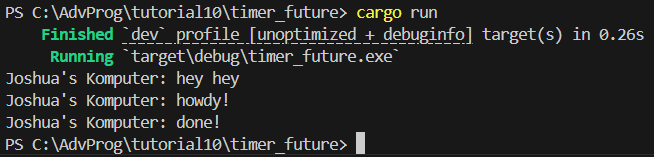
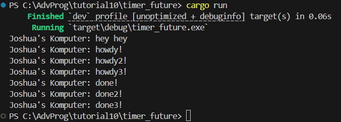
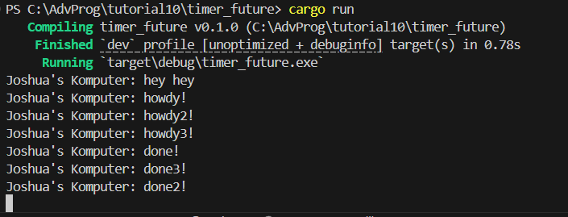

# Tutorial 10
**Nama:**   Joshua Montolalu<br>
**NPM:**    2306275746<br>
**Kelas:**  Pengjut A<br>

## Modul 10
### Experiment 1.2

- Dapat dilihat pada gambar bahwa pesan yang ditambahkan, yaitu `Joshua's Komputer: hey hey`, muncul terlebih dahulu. Hal ini terjadi karena perintah `println!()` ditaruh sebelum eksekusi fungsi *async*.
    ```rs
    println!("Joshua's Komputer: hey hey");

    // Drop the spawner so that our executor knows it is finished and won't
    // receive more incoming tasks to run.
    drop(spawner);

    // Run the executor until the task queue is empty.
    // This will print "howdy!", pause, and then print "done!".
    executor.run();
    ```
- Oleh karena itu, perintah `println!()` yang baru akan dilaksanakan terlebih dahulu secara sinkronus. Setelah itu baru akan dijalankan fungsi *async* oleh Rust. Jika `println!()` ditaruh setelah baris `executor.run()` maka perintah tersebut akan dijalankan setelah fungsi *async* dijalankan.

### Experiment 1.3
#### Multiple spawn

- Untuk eksperimen ini saya menambahkan lebih banyak `spawn`, seperti berikut:
    ```rs
    // Spawn a task to print before and after waiting on a timer.
    spawner.spawn(async {
        println!("Joshua's Komputer: howdy!");
        // Wait for our timer future to complete after two seconds.
        TimerFuture::new(Duration::new(2, 0)).await;
        println!("Joshua's Komputer: done!");
    });
    spawner.spawn(async {
        println!("Joshua's Komputer: howdy2!");
        // Wait for our timer future to complete after two seconds.
        TimerFuture::new(Duration::new(2, 0)).await;
        println!("Joshua's Komputer: done2!");
    });
    spawner.spawn(async {
        println!("Joshua's Komputer: howdy3!");
        // Wait for our timer future to complete after two seconds.
        TimerFuture::new(Duration::new(2, 0)).await;
        println!("Joshua's Komputer: done3!");
    });
    ```
- Ketika ada banyak *task* yang dibuat oleh `spawn`, maka setiap *task* (atau `Future`) akan ditaruh di dalam sebuah queue. Setiap `Future` akan di-*poll* oleh `executor` sampai `Future` tersebut sudah selesai. Kalau `Future` tersebut di-*poll* dan ternyata belum selesai, maka `Future` tersebut tidak akan kembali ke queue sampai sudah memanggil `wake()`, di mana proses ini akan berulang sampai `Future` di-*poll* dan sudah selesai.

- Pada kasus ini, setiap `Future` dimasukkan ke dalam queue dan di-*poll* agar `Future` tersebut dapat dimulai (dari baris `println!("Joshua's Komputer: howdy!");`). Lalu, setiap `Future` akan menunggu 2 detik dari fungsi *async* Timer, kemudian akan memanggil `wake()` untuk menandakan sudah siap diproses lagi. Masing-masing `Future` akan dikembalikan ke queue untuk di-*poll* oleh *executor* lagi, di mana setiap `Future` akan dijalankan lagi, yaitu baris `println!("Joshua's Komputer: done2!");`. Setiap `Future` dapat berjalan bersamaan karena bersifat asinkronus sehingga pesan muncul secara bersamaan, bukan secara sekuensial. 

#### Remove drop statement

- Untuk eksperimen ini saya menghapus perintah `drop()`, seperti berikut:
    ```rs
    // Drop the spawner so that our executor knows it is finished and won't
    // receive more incoming tasks to run.
    // drop(spawner);
    ```
- Jika dilihat dari gambar, terlihat bahwa program akan terus berjalan tanpa berhenti. Ini terjadi karena `executor` terus melakukan *loop* sambil menunggu `spawner` untuk menambahkan *task* ke dalam queue. Karena kita tidak memanggil `drop()`, maka `executor` tidak tahu bahwa tidak akan ada *task* lagi yang masuk dari kita. Oleh karena itu, program akan melakukan *infinite loop*.